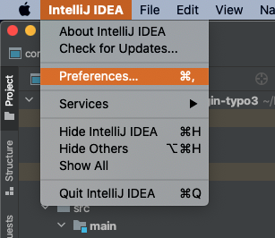
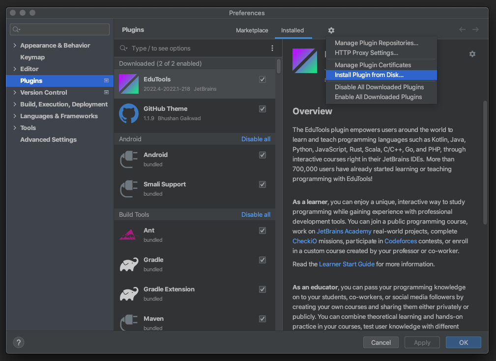
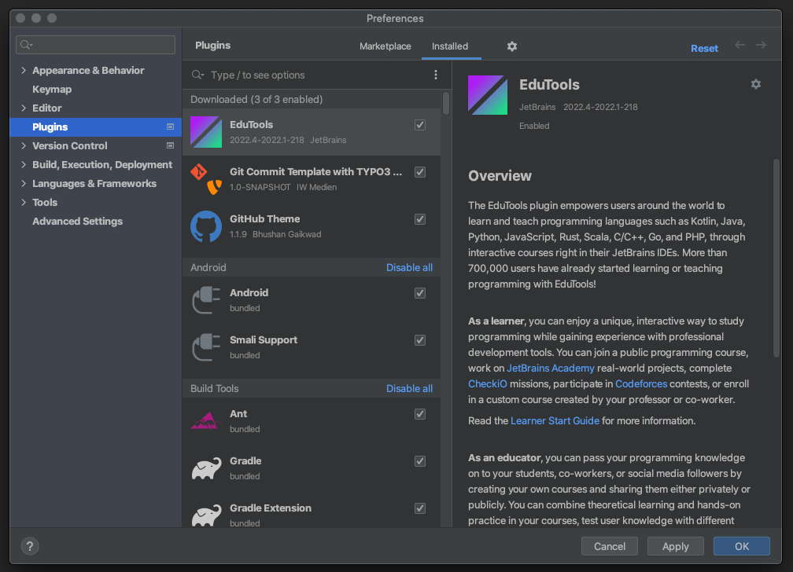
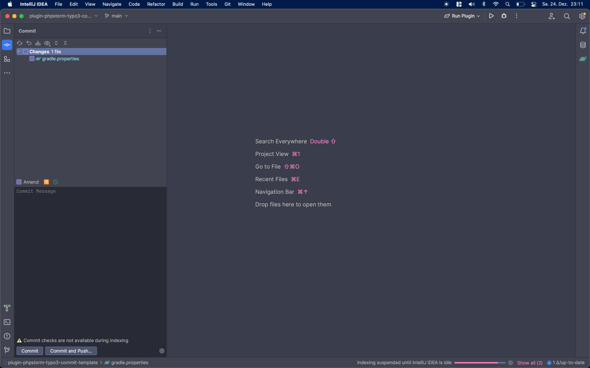
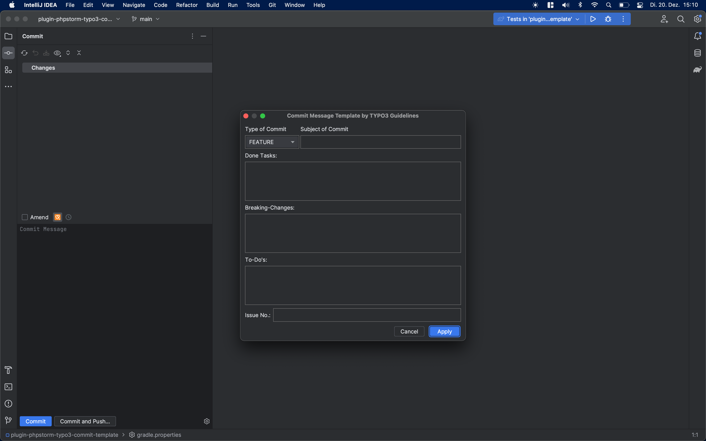
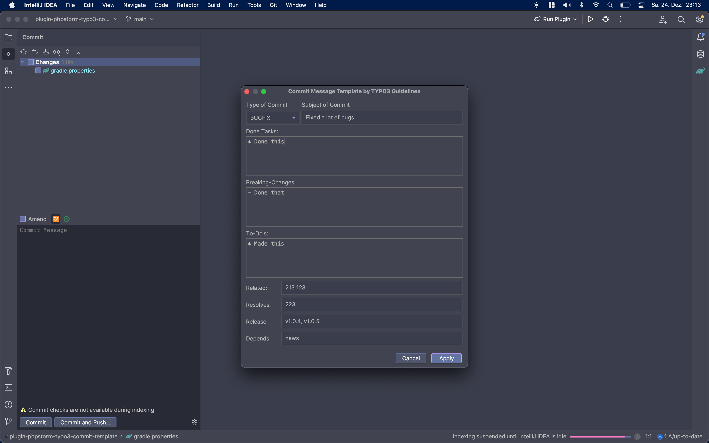
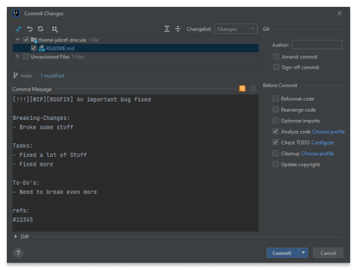

# plugin-phpstorm-typo3-commit-template


[](https://plugins.jetbrains.com/plugin/PLUGIN_ID)
[](https://plugins.jetbrains.com/plugin/PLUGIN_ID)

## Template ToDo list
- [x] Create a new [IntelliJ Platform Plugin Template][template] project.
- [x] Get familiar with the [template documentation][template].
- [x] Verify the [pluginGroup](./gradle.properties), [plugin ID](./src/main/resources/META-INF/plugin.xml) and [sources package](./src/main/kotlin).
- [x] Review the [Legal Agreements](https://plugins.jetbrains.com/docs/marketplace/legal-agreements.html?from=IJPluginTemplate).
- [ ] [Publish a plugin manually](https://plugins.jetbrains.com/docs/intellij/publishing-plugin.html?from=IJPluginTemplate) for the first time.
- [ ] Set the Plugin ID in the above README badges.
- [ ] Set the [Plugin Signing](https://plugins.jetbrains.com/docs/intellij/plugin-signing.html?from=IJPluginTemplate) related [secrets](https://github.com/JetBrains/intellij-platform-plugin-template#environment-variables).
- [ ] Set the [Deployment Token](https://plugins.jetbrains.com/docs/marketplace/plugin-upload.html?from=IJPluginTemplate).
- [ ] Click the <kbd>Watch</kbd> button on the top of the [IntelliJ Platform Plugin Template][template] to be notified about releases containing new features and fixes.

<!-- Plugin description -->
This plugin allows to create a commit message with the following template:

```html
[<FLAGS>][<TYPE>] <SUBJECT>

Breaking Changes: (optional) 
<BREAKING CHANGES HERE>    
    
Tasks: (optional) 
<TASK LIST HERE&>

To-Do's: (optional) 
<TO-DOs HERE>

refs: #<TICKET NUMBER HERE>
```

From the commit guidelines of TYPO3 [here](https://docs.typo3.org/m/typo3/guide-contributionworkflow/main/en-us/Appendix/CommitMessage.html).

## Installation

- Using IDE built-in plugin system:

  <kbd>Settings/Preferences</kbd> > <kbd>Plugins</kbd> > <kbd>Marketplace</kbd> > <kbd>Search for "plugin-phpstorm-typo3-commit-template"</kbd> >
  <kbd>Install Plugin</kbd>

- Manually:

  Download the [latest release](https://github.com/Inf166/plugin-phpstorm-typo3-commit-template/releases/latest) and install it manually using
  <kbd>Settings/Preferences</kbd> > <kbd>Plugins</kbd> > <kbd>⚙️</kbd> > <kbd>Install plugin from disk...</kbd>

  Open your preferences.<br>
  <br>
  
  Go to plugins in your preferences and select in the upper right "Install Plugin from Disk".<br>
  <br>
  
  Go to your downloaded JAR File and select it in the file-browser.<br>
  <br>
  
  Click apply/ok.<br>
  <br>

## Usage

Open your Commit-Dialog by clicking the module or pressing `Control/CMD + K`.<br>
You can open the template dialog by pressing `Control + Shift + K`.<br>
<br>

Once you are in the dialog, you can navigate by using the `Tab` Key.<br>
Fill the form as you see fit.<br>
<br>

If you are happy with your commit message, press `Apply` and the message will be templated
and inserted into your commit message dialog<br>
<br>

Please note, that the template is dynamic. So filling breaking changes will result in the `[!!!]` flag being set.<br>
This also works with the to-do list which results in the `[WIP]` flag being set.<br>
If you do not want any flags, just fill the `Done Tasks` Section, so only the Type will be displayed.<br>
<br>

## Open Tasks:
- [ ] Reorder the lists in Commit Message
- [ ] Fix Keyboard Shortcut
- [ ] Automatically commit and push selected changes
- [ ] Enhance UX by fixing Design and use different elements in Swing

<!-- Plugin description end -->

---
## Acknowledgements

### Git commit template Plugin for IntelliJ
Forked from: [[MobileTribe/commit-template-idea-plugin]](https://github.com/MobileTribe/commit-template-idea-plugin).
I used parts of his code, but heavily modified it and am planning on changing more.

### Plugin based on the [IntelliJ Platform Plugin Template][template].

[template]: https://github.com/JetBrains/intellij-platform-plugin-template
